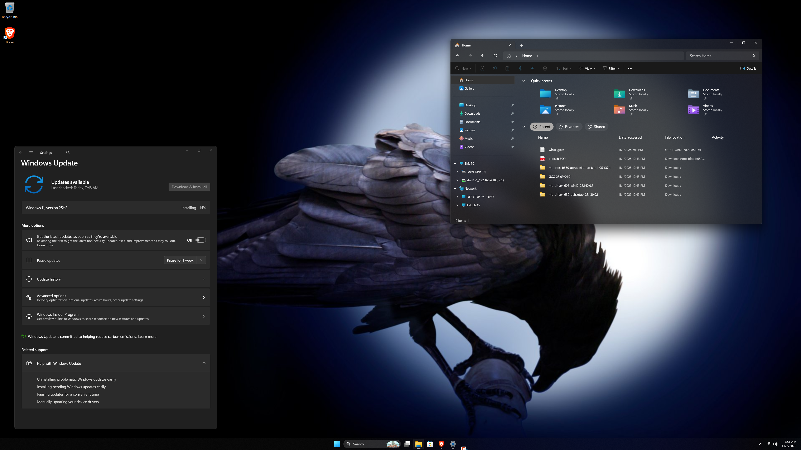

# Windows 11 Glass Desktop Automation

Automated PowerShell script to transform your Windows 11 desktop with beautiful glass/translucent effects in one click.




*Showcasing the complete glass desktop transformation: translucent taskbar with Acrylic blur, frosted glass File Explorer with transparent address bar, and Acrylic window backgrounds throughout Windows 11.*

## 🚀 Quick Start (3 Simple Steps)

```powershell
# 1. Download the script
git clone https://github.com/zhound420/windows-glass-desktop.git
cd windows-glass-desktop

# 2. Open PowerShell as Administrator, then run:
Set-ExecutionPolicy -ExecutionPolicy RemoteSigned -Scope CurrentUser

# 3. Run the script - it does everything automatically!
.\Install-GlassDesktop.ps1
```

**That's it!** Glass effects appear immediately:
- ✨ Your taskbar becomes translucent instantly
- ✨ Window backgrounds get the Acrylic blur effect
- ✨ Applications auto-launch and are configured to start at login
- ✨ File Explorer blur may require a restart to fully activate

## What This Does

This script automatically installs and configures three powerful tools to give your Windows 11 desktop a modern, translucent glass appearance:

- **MicaForEveryone** - Applies Mica/Acrylic effects to application windows
- **TranslucentTB** - Makes your taskbar translucent with blur effects
- **ExplorerBlurMica** - Adds beautiful blur effects to File Explorer

### Visual Effects Applied

- **Acrylic Window Backgrounds** - Frosted glass appearance on application windows
- **Acrylic Taskbar** - Translucent taskbar with blur
- **Acrylic File Explorer** - Blurred, modern look for Windows Explorer
- **Dark Theme Optimized** - Configurations tuned for dark mode aesthetics

## Prerequisites

- **Windows 10** (build 18362+) or **Windows 11**
- **Administrator privileges** (required for DLL registration)
- **Internet connection** (for downloading tools)
- **PowerShell 5.1+** (included with Windows)
- **Visual C++ Redistributables** - Required for ExplorerBlurMica
  - Download: [VC++ Redist x64](https://aka.ms/vs/17/release/vc_redist.x64.exe)
  - The script will notify you if this is missing

## Installation

### Quick Start

1. **Download the script:**
   ```powershell
   git clone <repository-url>
   # OR download Install-GlassDesktop.ps1 directly
   ```

2. **Open PowerShell as Administrator:**
   - Right-click Start Menu → Windows Terminal (Admin) or PowerShell (Admin)

3. **Set execution policy** (if needed):
   ```powershell
   Set-ExecutionPolicy -ExecutionPolicy RemoteSigned -Scope CurrentUser
   ```

4. **Run the installation:**
   ```powershell
   cd path\to\script
   .\Install-GlassDesktop.ps1
   ```

5. **Effects appear immediately!** (File Explorer may need restart)

### What Happens During Installation

The script will:
1. ✅ Check Windows version compatibility
2. ✅ Verify administrator privileges
3. ✅ Auto-install Visual C++ Redistributables if needed
4. ✅ Install WinGet if not present
5. ✅ Download and install MicaForEveryone (with MSIX fallback)
6. ✅ Download and install TranslucentTB (with MSIX fallback)
7. ✅ **Launch both applications automatically**
8. ✅ **Configure auto-startup at login via Task Scheduler**
9. ✅ Download and extract ExplorerBlurMica from GitHub
10. ✅ Configure all tools with Acrylic effects
11. ✅ Unblock downloaded DLL files
12. ✅ Register ExplorerBlurMica DLL
13. ✅ Restart Windows Explorer
14. ✅ Display installation summary

**No manual steps required** - everything is automated!

## Usage

### Install Glass Desktop
```powershell
# Simply run the script (installs automatically)
.\Install-GlassDesktop.ps1
```

### Show Help
```powershell
.\Install-GlassDesktop.ps1 -Help
```

### Uninstall Glass Desktop
```powershell
.\Install-GlassDesktop.ps1 -Uninstall
```

The uninstall function will:
- Remove all three tools
- Unregister the ExplorerBlurMica DLL
- Clean up configuration files
- Restore default Windows appearance

## Configuration

### Default Settings Applied

The script configures all tools with these settings:

#### ExplorerBlurMica
- **Effect:** Acrylic (effect=1)
- **Clear Address Bar:** Enabled
- **Clear Toolbar Background:** Enabled
- **Show Dividing Line:** Enabled

#### MicaForEveryone
- **Global Effect:** Acrylic backdrop
- **Title Bar Color:** Dark
- **File Explorer:** Acrylic with system color

#### TranslucentTB
- **Default:** Acrylic frosted appearance
- **Customization:** Right-click tray icon after installation

### Customizing Effects

#### Change ExplorerBlurMica Effect
Edit: `C:\Program Files\ExplorerBlurMica\config.ini`

```ini
[config]
effect=1    ; 0=Blur, 1=Acrylic, 2=Mica, 3=Blur(Clear), 4=MicaAlt
```

After editing, restart Explorer:
```powershell
Stop-Process -Name explorer -Force
```

#### Change MicaForEveryone Settings
Edit: `%LOCALAPPDATA%\Mica For Everyone\config.xcl`

```
Global: "" {
    TitleBarColor = Dark
    BackdropPreference = Acrylic
}

Process: "notepad" {
    BackdropPreference = Mica
}
```

Launch MicaForEveryone from Start Menu to reload configuration.

#### Customize TranslucentTB
1. Right-click the TranslucentTB icon in system tray
2. Select preferred taskbar appearance:
   - Acrylic (frosted glass)
   - Clear (fully transparent)
   - Blur (simple blur)
   - Opaque (solid)

## Troubleshooting

### Script Won't Run
**Issue:** "execution of scripts is disabled on this system"

**Solution:**
```powershell
Set-ExecutionPolicy -ExecutionPolicy RemoteSigned -Scope CurrentUser
```

### WinGet Not Found
**Issue:** Script can't find WinGet

**Solution:**
- Install "App Installer" from Microsoft Store
- Or download from: https://aka.ms/getwinget

### Effects Not Appearing
**Issue:** Installed but no visual changes

**Note:** As of the latest version, the script automatically launches applications, so effects should appear immediately.

**If effects still don't appear:**
1. Check if apps are running:
   - Look for TranslucentTB icon in system tray
   - Check Task Manager for "MicaForEveryone" process
2. Ensure Windows 11 transparency effects are enabled:
   - Settings → Personalization → Colors → Transparency effects = ON
3. For File Explorer blur: Restart your computer
4. If apps aren't running, launch them manually from Start Menu:
   - MicaForEveryone
   - TranslucentTB

### ExplorerBlurMica Not Working
**Issue:** File Explorer has no blur effect

**Solutions:**
1. Verify DLL is registered:
   ```powershell
   regsvr32 "C:\Program Files\ExplorerBlurMica\ExplorerBlurMica.dll"
   ```
2. Check config.ini exists at: `C:\Program Files\ExplorerBlurMica\config.ini`
3. Restart Explorer:
   ```powershell
   Stop-Process -Name explorer -Force
   ```

### Access Denied Errors
**Issue:** Script fails with "Access Denied"

**Solution:**
- Run PowerShell as Administrator (required!)
- Disable antivirus temporarily if it blocks DLL registration

### DLL Registration Failed (0xC0000005)
**Issue:** ExplorerBlurMica fails with Access Violation error

**Solution:**
This error means Visual C++ Redistributables are missing:
1. Download and install: [VC++ Redist x64](https://aka.ms/vs/17/release/vc_redist.x64.exe)
2. Restart your computer
3. Run the installation script again

### WinGet Package Not Available (-1978335189)
**Issue:** MicaForEveryone or TranslucentTB installation fails

**Solution:**
Install manually from GitHub releases:
- **MicaForEveryone**: https://github.com/MicaForEveryone/MicaForEveryone/releases
  - Download the `.msixbundle` file
  - Double-click to install
- **TranslucentTB**: https://github.com/TranslucentTB/TranslucentTB/releases
  - Download the `.msixbundle` file
  - Double-click to install

Alternatively, try installing from Microsoft Store:
- MicaForEveryone: Search in Microsoft Store
- TranslucentTB: Search "TranslucentTB" in Microsoft Store

### All Components Failed
**Issue:** Nothing installs successfully

**Common Causes:**
1. **Missing VC++ Redistributables** - Install from link above
2. **WinGet not working** - Update Windows or install App Installer from Microsoft Store
3. **Network/Firewall issues** - Check internet connection and firewall settings
4. **Antivirus blocking** - Temporarily disable antivirus during installation

## Tools Used

This script automates the installation of these excellent open-source projects:

| Tool | Purpose | Repository |
|------|---------|------------|
| **MicaForEveryone** | Applies Mica/Acrylic to any app | [GitHub](https://github.com/MicaForEveryone/MicaForEveryone) |
| **ExplorerBlurMica** | Blur effects for File Explorer | [GitHub](https://github.com/Maplespe/ExplorerBlurMica) |
| **TranslucentTB** | Translucent taskbar | [GitHub](https://github.com/TranslucentTB/TranslucentTB) |

### Credits

All credit for the visual effects goes to the amazing developers of:
- [MicaForEveryone](https://github.com/MicaForEveryone/MicaForEveryone) by MicaForEveryone Team
- [ExplorerBlurMica](https://github.com/Maplespe/ExplorerBlurMica) by Maplespe
- [TranslucentTB](https://github.com/TranslucentTB/TranslucentTB) by TranslucentTB Team

This script simply automates their installation and configuration.

## FAQ

**Q: Is this safe?**
A: Yes! All tools are open-source and widely used. The script only downloads from official GitHub releases and Microsoft Store.

**Q: Will this slow down my computer?**
A: No. These tools have minimal performance impact. TranslucentTB uses <10MB RAM, MicaForEveryone is very lightweight.

**Q: Can I customize individual apps?**
A: Yes! Edit the MicaForEveryone config to apply different effects per application.

**Q: Does this work on Windows 10?**
A: Partially. Windows 10 (build 18362+) supports some effects, but full Mica/Acrylic requires Windows 11.

**Q: How do I update the tools?**
A: Run the installation script again, or use:
```powershell
winget upgrade --all
```

**Q: Will this survive Windows updates?**
A: Yes, but you may need to re-run the script if Windows updates break the effects.

**Q: Why did installation fail with error -1978335189?**
A: This is a WinGet package error. The packages may be temporarily unavailable or your WinGet needs updating. Install the tools manually from their GitHub releases pages (see Troubleshooting section).

**Q: What is error 0xC0000005 (Access Violation)?**
A: This means Visual C++ Redistributables are missing. Download and install from: https://aka.ms/vs/17/release/vc_redist.x64.exe

**Q: Do I need Visual C++ Redistributables?**
A: Yes, ExplorerBlurMica requires them. The script will tell you if they're missing and provide a download link.

**Q: Can I install the tools individually if the script fails?**
A: Yes! See the "Manual Installation" section below for step-by-step instructions.

## Manual Installation

If the automated script fails, you can install each tool manually:

### MicaForEveryone
1. Visit: https://github.com/MicaForEveryone/MicaForEveryone/releases
2. Download the latest `.msixbundle` file
3. Double-click the file to install
4. Launch from Start Menu

### TranslucentTB
1. Visit: https://github.com/TranslucentTB/TranslucentTB/releases
2. Download the latest `.msixbundle` file
3. Double-click the file to install
4. Launch from Start Menu

### ExplorerBlurMica
1. Install Visual C++ Redistributables: [Download x64](https://aka.ms/vs/17/release/vc_redist.x64.exe)
2. Restart your computer
3. Visit: https://github.com/Maplespe/ExplorerBlurMica/releases
4. Download `Release_x64.zip`
5. Extract to: `C:\Program Files\ExplorerBlurMica\`
6. Open PowerShell as Administrator and run:
   ```powershell
   regsvr32 "C:\Program Files\ExplorerBlurMica\ExplorerBlurMica.dll"
   ```
7. Restart Windows Explorer:
   ```powershell
   Stop-Process -Name explorer -Force
   ```

## Uninstallation

To completely remove all glass effects and restore defaults:

```powershell
.\Install-GlassDesktop.ps1 -Uninstall
```

The script will:
- Uninstall MicaForEveryone
- Uninstall TranslucentTB
- Unregister and remove ExplorerBlurMica
- Clean up all configuration files
- Restart Explorer

## Known Issues

- **WinGet Package Availability**: Sometimes WinGet packages are temporarily unavailable. Use manual installation if this happens.
- **VC++ Redistributables**: ExplorerBlurMica requires Visual C++ Redistributables. The script will detect and notify you if missing.
- **First Run**: Some effects may require a restart or logout to appear fully.
- **Antivirus Interference**: Some antivirus software may block DLL registration. Temporarily disable if needed.

## License

This automation script is provided as-is for educational purposes. Each tool has its own license:
- MicaForEveryone: MIT License
- ExplorerBlurMica: MIT License
- TranslucentTB: GPL-3.0 License

## Support

For issues with:
- **This script:** Open an issue in this repository
- **MicaForEveryone:** Visit [their GitHub](https://github.com/MicaForEveryone/MicaForEveryone/issues)
- **ExplorerBlurMica:** Visit [their GitHub](https://github.com/Maplespe/ExplorerBlurMica/issues)
- **TranslucentTB:** Visit [their GitHub](https://github.com/TranslucentTB/TranslucentTB/issues)

## Contributing

Contributions are welcome! Feel free to:
- Report bugs
- Suggest new features
- Submit pull requests
- Improve documentation

---

**Note:** This project is not affiliated with Microsoft. Windows 11 is a trademark of Microsoft Corporation.
